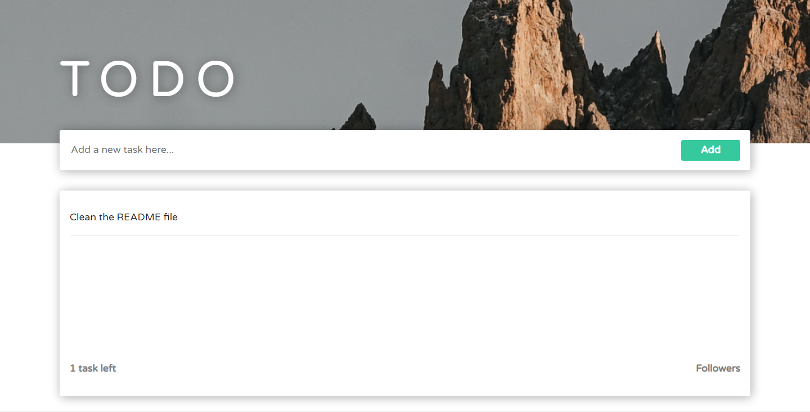
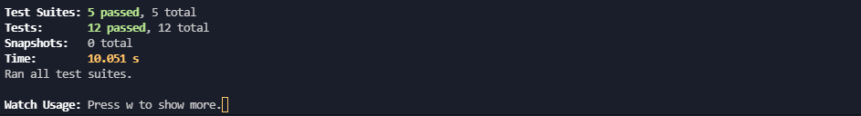

# TODO APP

This project was bootstrapped with [Create React App](https://github.com/facebook/create-react-app) and it was created to practice React Testing Library.

## Layout

In the project , you can find a project that looks pretty much with:

  

## In this Project You Can Run

### `npm run test`

After have all dependecies installed, `npm run test` will allow you to run all tests performed in the project, that should give you a result of something like:

  

Have Fun!
